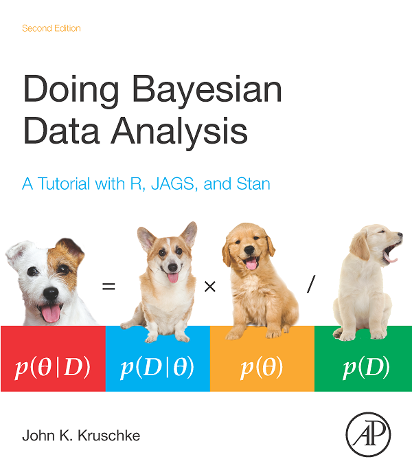

```{r setup, include = FALSE}
knitr::opts_chunk$set(warning = FALSE, message = FALSE)
options(digits = 3)
```

## Philosophies/perspectives in statistics

**Neither is wrong. These are both valid approaches to the same problem:**

### Frequentist (Classical) Inference

- Population parameters are fixed values to be estimated from a sample
- Sample estimate approaches the truth as sample size $n \rightarrow N$ (size of population)
- *95% Confidence Interval* = "If the experiment is repeated 100 times, we can expect 95 of the intervals generated to contain the true value of the parameter. This interval may be one of those 95 or it may be one of the other 5."

### Bayesian Inference

- Parameters are random variables with distributions
- Posterior $\propto$ ("proportional to") Likelihood $\times$ Prior
- *95% Credible Interval* = "There is a 95% probability that the true parameter is contained in this interval."

## Why be a Bayesian?

Putting the issue of Null Hypothesis Significance Testing (NHST) and *p*-value thresholds aside:

- Bayesian approach mirrors how we actually make decisions.
    - Use previous research and expert opinion.
- Update posterior as you learn more and collect more data.
    - Old posterior becomes new prior; new posterior is calculated.


## Notation

A *random variable* can take on different values, each with some probability.

Let $X$ and $Y$ be random variables.

- The random variable $Y|X$ is $Y$ conditional on $X$ ("Y given X")
- $p(y) = P(Y = y)$ is the probability of the random variable $Y$ being $y$
- $p(y|x) = P(Y = y~|~X = x)$ is the probability of $Y$ being $y$ given that $X = x$
- **(Optional, for future ref.)** $\mathbb{E}(X)$ is the expected value of $X$ ("the mean")
    - $\mathbb{E}(X) = \sum x~p(x)$ is the mean of a discrete r.v. $X$
    - $\mathbb{E}(X) = \int x~p(x)~dx$ is the mean of a continuous r.v. $X$

## Bayes' Theorem

For events $A$ and $B$, Bayes' rule states that the conditional probability of $A$ given $B$ can be expressed as:

$$P(A|B) = \frac{P(A)~P(B|A)}{P(B)}$$

**Example**: Suppose a user is having problems searching Wikipedia.

We suspect the issue is a rare bug. We might know that the bug affects 0.18% of the userbase. The user can install a tool that collects data (tracks their entire session) and sends it to our servers for analysis, but before they give up privacy, they want to know the probability the tool will actually help detect the bug. Suppose it has sensitivity of 91% (probability of detecting bug if affected by bug). Overall, tool returns "pos" 3% of the time and "neg" 97% of the time.

$$P(\text{bug}~|~\text{"positive"}) = \frac{P(\text{bug}) \times P(\text{"positive"}~|~\text{bug})}{P(\text{"positive"})} = \frac{0.0018 \times 0.91}{0.03} = 0.055$$

If the user installs the tool, they have a 5.5% chance of detecting the bug if they actually have it.

## Bayesian Inference

Let $\theta$ be the unobserved quantity we're interested in (the parameter) and $y$ be the observed quantity (the data). Then $$p(\theta|y) = \frac{p(\theta,y)}{p(y)} = \frac{p(\theta)~p(y|\theta)}{p(y)}$$

An equivalent form of this omits the factor $p(y)$ because $y$ is fixed and $p(y)$ does not depend on $\theta$, which yields the unnormalized posterior density that is proportional to the product of the likelihood and the prior: $$p(\theta|y) \propto p(y|\theta)~p(\theta)$$

## Example: Binomial Data

Let $\theta$ represent the probability of success in each Bernoulli trial. The model for the number of successes $y$ in $n$ trials is the Binomial model: $$y|\theta~\sim~\text{Binom}(n,\theta)$$

### Estimating $\theta$:

- **Frequentist (Classical)** approach:
    - $\hat{\theta} = \frac{y}{n}$ is an unbiased estimator of fixed parameter $\theta$
    - As $n \rightarrow N$, $\hat{\theta} \rightarrow \theta$

- **Bayesian** approach:
    - Interested in distribution of r.v. parameter $\theta$ given the data $y$
    - The mean of posterior distribution can be used as a point estimate
    - Apply Bayes' rule to get: $p(\theta~|~y) \propto p(y~|~\theta)~p(\theta)$
    - We know $p(y~|~\theta)$, but what is $p(\theta)$?

## Conjugacy

A *conjugate prior* is a prior distribution that yields a posterior distribution in the same family. This is rarely the case, but makes for clean, minty maths.

| Prior | Likelihood | Posterior |
|:-----:|:----------:|:---------:|
| Beta  | Binomial   | Beta      |
| Beta | Negative Binomial | Beta |
| Gamma | Poisson | Gamma |
| Beta | Geometric | Beta |
| Gamma | Exponential | Gamma |
| Normal | Normal (mean unknown) | Normal |
| Inverse Gamma | Normal (variance unknown) | Inverse Gamma |
| Dirichlet | Multinomial | Dirichlet |

## Example cont'd: Beta-Binomial Model

Beta is a *conjugate prior* for the Binomial likelihood, so the posterior is also a Beta.

- Binomial likelihood: $p(y~|~n, \theta) = \dbinom{n}{y} \theta^y (1-\theta)^{n-y}$
- Beta prior: $p(\theta) = p(\theta~|~\alpha, \beta) = \frac{\theta^{\alpha-1}(1-\theta)^{\beta-1}}{\text{B}(\alpha, \beta)},$ where $\text{B}(\alpha, \beta) = \frac{\Gamma(\alpha+\beta)}{\Gamma(\alpha)\Gamma(\beta)}$ and $\Gamma(x) = (x-1)!$
- Posterior: $p(\theta~|~y) \propto p(y|\theta)~p(\theta)$
$$p(\theta|y) \propto \dbinom{n}{y} \theta^y (1-\theta)^{n-y} \times \frac{\theta^{\alpha-1}(1-\theta)^{\beta-1}}{\text{B}(\alpha, \beta)},$$ which we can simplify to: $$p(\theta~|~y) \propto \theta^{(y+\alpha)-1} (1-\theta)^{(n-y+\beta)-1}$$

...which looks like the probability density function for the Beta distribution, sans normalizing constant! Therefore: $$\theta~|~y~\sim~\text{Beta}(y+\alpha, n-y+\beta)$$

## Hyperparamaters, hyper-hyperparameters, and oh my!

**Problem**: we need to specify the hyperparameters $\alpha$ and $\beta$.

**Solutions**:

- *Noninformative flat prior*: pick $\text{Beta}(\alpha = 1, \beta = 1)$ which is equivalent to $\text{Uniform}(0, 1)$
- *Jeffreys prior*: noninformative, but outside the scope of this talk
- *Informative prior*: pick values that reflect your prior belief about the shape of $p(\theta)$
- *Hierarchical model*: assign a prior distribution (a "hyperprior") to $\alpha$ and $\beta$ so posterior becomes: $$p(\theta~|~y) \propto p(y~|~\theta, \alpha, \beta) \times p(\theta~|~\alpha, \beta) \times p(\alpha~|~\beta) \times p(\beta)$$ which utilize hyper-hyperparameters for $p(\alpha)$ and $p(\beta)$

Let's see how our choice of hyperparameters affects the posterior...

## The Prior-Data-Posterior Relationship
```{r, echo = FALSE}
normalize_density <- function(x) {
  return(x/max(x))
}
shinyApp(
  ui = fluidPage(
    fluidRow(
      column(sliderInput('n', 'Coin flips', 0, 500, step = 5, value = 10), width = 4),
      column(sliderInput('a_1', 'Shape parameter α', 0, 100, step = 1, value = 1), width = 4),
      column(sliderInput('b_1', 'Shape parameter β', 0, 100, step = 1, value = 1), width = 4)),
    plotOutput('prior_posterior')
  ),
  server = function(input, output) {
    prob_head <- 0.64
    flips <- reactiveValues(n = 0, y = 0)
    observe({
      input$n
      set.seed(0)
      flips$n <- isolate(input$n)
      flips$y <- sum(rbinom(isolate(input$n), 1, prob_head))
    })
    output$prior_posterior <- renderPlot({
      n <- flips$n
      y <- flips$y
      p <- prob_head
      a_prior <- input$a_1
      b_prior <- input$b_1
      x <- seq(0, 1, 0.01)
      likelihood <- normalize_density(sapply(x, function(theta) {
        dbinom(y, n, prob = theta)
      }))
      y_prior <- normalize_density(dbeta(x, a_prior, b_prior))
      a_post <- a_prior + y
      b_post <- b_prior + n - y
      y_post <- normalize_density(dbeta(x, a_post, b_post))
      plot(x, y_prior, main = "Prior and Posterior",
           xlab = expression(theta), ylab = "density (normalized for visualization)",
           type = "l", lty = "dotted", yaxt = "n", ylim = c(0, 1), lwd = 2)
      
      x_lower <- qbeta(0.025, a_post, b_post)
      x_upper <- qbeta(0.975, a_post, b_post)
      x2 <- seq(x_lower, x_upper, length.out = 1000)
      polygon(c(x_lower, x2, x_upper, x_lower),
              c(0, normalize_density(dbeta(x2, a_post, b_post)), 0, 0), col = rgb(0.5, 0.5, 0.5, 0.25))
      abline(v = p, lty = "solid", lwd = 2, col = "blue")
      abline(v = y/n, lty = "dashed", lwd = 2, col = "red")
      lines(x, likelihood, lty = "dashed", lwd = 2, col = "red")
      lines(x, y_post, lwd = 2)
      legend("topleft", c(sprintf("Prior: Beta(%.0f,%.0f)", a_prior, b_prior),
                          sprintf("Likelhood & sample prop based on %.0f heads in %.0f flips", y, n),
                          sprintf("Posterior: Beta(%.0f,%.0f)", a_post, b_post)),
             lty = c("dotted", "dashed", "solid"), lwd = 2,
             col = c("black", "red", "black"))
    })
  }, options = list(width = 800)
)
```

## Aside: _"MCMC is my favorite MC"_

Most real world problems and models are way more complex, so the posterior **cannot be calculated analytically**.

Instead, we **approximate** the posterior distribution through **simulation** -- usually **_Markov Chain Monte Carlo_** (MCMC).

Sampling algorithms ("**_samplers_**") allow us to simulate random samples from arbitrary univariate and multivariate posterior distributions:

- **Rejection sampling** ("acceptance-rejection method")
- **Metropolis-Hastings algorithm**
- **Gibbs sampling** (a special case of Metropolis-Hastings algorithm)
    - Used in *WinBUGS*, *OpenBUGS*, and *JAGS*
- **No-U-Turn sampler** (extends Hamiltonian Monte Carlo)
    - Used in *Stan*

**Note** that an MCMC chain doesn't converge to a value -- *it converges to a distribution*. For point estimates, we can use the mean, median, or mode of the values sampled.

## Application to A/B Testing

### A/B test results as a 2×2 contingency table

|                               | Event                  | No Event               | Total in each group            |
|------------------------------:|:----------------------:|:----------------------:|:------------------------------:|
| Test group / "Variation B"    | $n_{11}$               | $n_{12}$               | $n_{1+} = n_{1 \cdot}$         |
| Control group / "Variation A" | $n_{21}$               | $n_{22}$               | $n_{2+} = n_{2 \cdot}$         |
| Total in each outcome         | $n_{+1} = n_{\cdot 1}$ | $n_{+2} = n_{\cdot 2}$ | $n_{++} = n_{\cdot \cdot} = n$ |

### A note on order

Having the test group and event be the first row and column, respectively, is done for convenience and intuition. For example, the odds ratio is defined as $\frac{n_{11}/n_{12}}{n_{21}/n_{22}}$ which tells us whether the first group has higher or lower odds of having the event than the second (reference) group.

## 

### Independent Binomial Model for 2×2 Contingency Tables

|         | Event   | No Event  |
|--------:|:-------:|:---------:|
| Group 1 | $\pi_1$ | $1-\pi_1$ |
| Group 2 | $\pi_2$ | $1-\pi_2$ |

### Multinomial Model for 2×2 Contingency Tables

|          | Event      | No Event   | Marginal   |
|---------:|:----------:|:----------:|:----------:|
| Group 1  | $\pi_{11}$ | $\pi_{12}$ | $\pi_{1+}$ |
| Group 2  | $\pi_{21}$ | $\pi_{22}$ | $\pi_{2+}$ |
| Marginal | $\pi_{+1}$ | $\pi_{+2}$ |            |

## A/B Test: Completion Suggester

The completion suggester was meant to replace prefix searching, with the aim of increasing recall.

Users were randomly chosen to be entered into the test, either as controls or a test subject with the completion suggester.

We were interested in the final outcome of their search session. In other words: did they get some or zero results when they finished typing their query?

|                 | Results| Zero Results|
|:----------------|-------:|------------:|
|Suggester (Test) |    4911|          857|
|Controls         |    4834|         1418|

### Question of interest

Which method is more likely to yield nonzero results?

##

### Data

```{r}
cs <- matrix(c(4911, 857, 4834, 1418), nrow = 2, byrow = TRUE,
             dimnames = list("Group" = c("Suggester (Test)", "Controls"),
                             "Last Event" = c("Results", "Zero Results")))
```

### Model

For each $i$-th group, we model the count of successful searches with $\text{Binomial}(n_i, \pi_i)$, with a Beta prior on $\pi_i$ ($i = 1, 2$).

### Methods

For this example we will use the functions `diffCI`, `riskCI`, and `orCI` by Agresti, A. and Min, Y. (http://www.stat.ufl.edu/~aa/cda/R/bayes/bayes.html)

**Reference**: Agresti, A., & Min, Y. (2005). Frequentist performance of Bayesian confidence intervals for comparing proportions in 2 x 2 contingency tables. *Biometrics*, **61**(2), 515–523. http://doi.org/10.1111/j.1541-0420.2005.031228.x

## Bayesian C.I. Functions

Sadly, the easiest way to use the code they provided is to scrape it off the web:

```{r, cache = TRUE}
suppressMessages(library(rvest))
bayes <- read_html('http://www.stat.ufl.edu/~aa/cda/R/bayes/bayes.html')
bayes %<>% html_nodes('pre') %>% # 
  {.[-2]} %>% # Second element is for Highest Posterior Density (HPD) CIs
  html_text() %>% gsub('\n(-+)', '', .) %>% as.list()
names(bayes) <- c('prop_diff', 'rel_risk', 'odds_ratio')

# Some of the functions in the code chunks share names, so we need to
# isolate them into separate environments to avoid conflicts:
prop_diff <- new.env(); rel_risk <- new.env(); odds_ratio <- new.env()

# Now we parse & evaluate the chunks into the appropriate environments:
eval(parse(text = bayes$prop_diff), envir = prop_diff)
eval(parse(text = bayes$rel_risk), envir = rel_risk)
eval(parse(text = bayes$odds_ratio), envir = odds_ratio)
```

We can now use the functions `prop_diff$diffCI()`, `rel_risk$riskCI()`, and `odds_ratio$orCI()`. Alternatively: `BCDA::ci_prop_diff_tail()`, `BCDA::ci_relative_risk()`, and `BCDA::ci_odds_ratio()`.

## 1. Difference of Proportions

To obtain a Bayesian confidence interval for the difference $\pi_1-\pi_2$:

```{r}
prop_diff$diffCI(x1 = cs[1, 1], n1 = sum(cs[1, ]),
                 x2 = cs[2, 1], n2 = sum(cs[2, ]),
                 a = 1, b = 1, c = 1, d = 1) # Beta(1,1) prior
# Alternatively: BCDA::ci_prop_diff_tail(cs)
```

### Interpretation

The proportion of searches getting nonzero results goes up by 6.4%-9.1% in the group using the completion suggester.

## 2. Relative Risk

The **relative risk** is the ratio of the probability of the event occurring in the exposed group to the probability of the event occurring in the comparison (non-exposed) group: $\pi_1/\pi_2$:

```{r}
rel_risk$riskCI(x1 = cs[1, 1], n1 = sum(cs[1, ]),
                x2 = cs[2, 1], n2 = sum(cs[2, ]),
                a = 1, b = 1, c = 1, d = 1) # Beta(1,1) prior
# Alternatively: BCDA::ci_relative_risk(cs)
```

### Interpretation

The group with completion suggester was (with 95% probability) 1.08-1.12 times more likely to get nonzero results.

## 3. Odds Ratio

Another way to measure the effect is to calculate the ratio of the odds of the event occurring: $\frac{\pi_1/(1-\pi_1)}{\pi_2/(1-\pi_2)}$

```{r}
odds_ratio$orCI(x1 = cs[1, 1], n1 = sum(cs[1, ]),
                x2 = cs[2, 1], n2 = sum(cs[2, ]),
                a = 1, b = 1, c = 1, d = 1) # Beta(1,1) prior
# Alternatively: BCDA::ci_odds_ratio(cs)
```

### Interpretation

The odds of suggester group getting nonzero results were (with 95% probability) 1.53-1.85 times those of controls.

In other words, having the completion suggester is associated with higher odds of getting nonzero results.

## Recommended Reading

<div class="columns-2">
  
  
  - Lynch, S. M. (2007). Introduction to Applied Bayesian Statistics and Estimation for Social Scientists. (S. M. Lynch, Ed.). New York, NY: Springer Science & Business Media.
  - Albert, J. (2009). Bayesian Computation with R. Springer Science & Business Media.
  - Gelman, A., Carlin, J. B., Stern, H. S., Dunson, D. B., Vehtari, A., & Rubin, D. B. (2013). Bayesian Data Analysis, Third Edition. CRC Press.
  - Gelman, A., & Hill, J. (2006). Data Analysis Using Regression and Multilevel/Hierarchical Models. Cambridge University Press.
</div>

##


Bayesian statistics is cool, and if Beyoncé was a statistician, there is a 95% probability she would be a Bayesian. Would that make her a Beysian?
