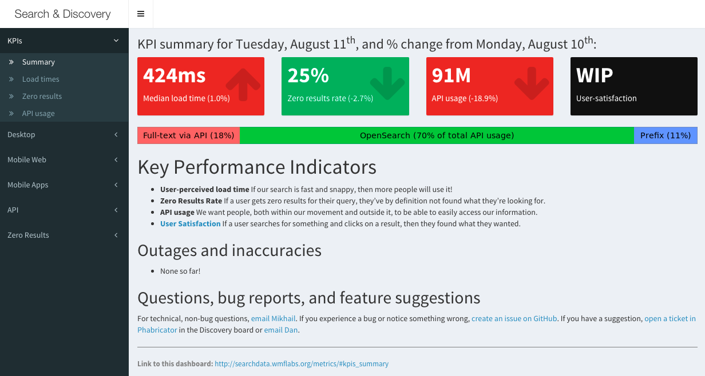

```{r setup, include = FALSE}
knitr::opts_chunk$set(echo = FALSE, message = FALSE, warning = FALSE)
# devtools::install_github('rstudio/rmarkdown')
# devtools::install_github('rstudio/shiny')
# devtools::install_github('yihui/knitr', build_vignettes = TRUE)
library(magrittr)
```

## Overview

Source code for this presentation: **[bit.ly/shinydash_wmf](http://bit.ly/shinydash_wmf)**

> * Intro to R
> * Intro to Shiny
> * Shiny Dashboards
> * Tour of visualization packages

## A brief introduction to R:

> * Born in academia from S
> * Not developed by people whose primary focus was computer science
> * Quirky to program in, but great for data analysis

## Introduction to R programming

**R** is a programming language and an environment for statistical computing and graphics

```{r, echo = TRUE}
set.seed(0) # for reproducibility
x <- sample(1:20, 100, replace = TRUE)
head(x)
intercept <- runif(1, 10, 20) # 16.049
slope <- rnorm(1) # 0.398
noise <- rnorm(100, 0, 2) # errors ~ N(0,1)
y <- intercept + slope * x + noise
head(y)
```

## Regression and visualization

```{r, echo = TRUE, fig.height = 4, fig.width = 7}
fit <- lm(y ~ x) # simple linear regression
par(mfrow = c(1, 2)) # multiple plots in one overall graph
hist(y, probability = TRUE) # histogram
lines(density(y)) # estimate and overlay a curve
plot(x, y); abline(fit) # scatter plot with a fitted line
```

## A brief introduction to Shiny

* A web application framework for R developed by RStudio, Inc.
* No HTML, CSS, or JavaScript knowledge required

```{r, echo = TRUE, eval = FALSE}
library(shiny)

# Inputs:
numericInput("breaks", "Bins", min = 1, max = 100, value = 20)
sliderInput("smooth", "Smoothness", min = 0.1, max = 5, step = 0.1, value = 1)

# Output that react to inputs:
renderPlot({
  hist(y, freq = FALSE, breaks = input$smooth,
       col = "cornflowerblue", border = "white")
  lines(density(y, adjust = input$smooth), lwd = 2)
})
```

## Demonstration

```{r, echo = FALSE, eval = TRUE, fig.width = 6, fig.height = 4}
library(shiny)
fluidRow(column(numericInput("breaks", "Bins",
                             min = 10, max = 30, value = 20, step = 10),
                width = 6),
         column(sliderInput("smooth", "Smoothness",
                            min = 0.1, max = 5, step = 0.1, value = 0.5),
                width = 6))
renderPlot({
  hist(y, freq = FALSE, breaks = input$breaks,
       col = "cornflowerblue", border = "white")
  lines(density(y, adjust = input$smooth), lwd = 2)
})
```

## Shiny Dashboards



## Minimal possible dashboard

A dashboard has three parts: a header, a sidebar, and a body.

```{r, eval = FALSE, echo = TRUE}
library(shiny)
library(shinydashboard)

ui <- dashboardPage(
  dashboardHeader(),
  dashboardSidebar(),
  dashboardBody()
)

server <- function(input, output) { }

shinyApp(ui, server)
```

In reality, you'll be using a **ui.R** file and a **server.R** file for your user interface and logic, respectively.

For a more fleshed-out template based on our Metrics dashboard, please see *[Building a Shiny Dashboard](https://wikitech.wikimedia.org/wiki/Building_a_Shiny_Dashboard)* on Wikitech.

## Modules

* Can be added to the dashboard via `tabItem` from the __shinydashboard__ package
* Linked to via `menuItem`/`menuSubItem` within the `sidebarMenu`
* a `tabItem` can include input & output elements and static & dynamic content

For more information, see the  [Modules](https://wikitech.wikimedia.org/wiki/Building_a_Shiny_Dashboard#Modules) section.

### Data Hooks

1. Write R/Python/Bash scripts that connect to MySQL/Hive and extract data
2. Store extracted data in **/a/aggregate-datasets/**, for example
3. Schedule scripts to run daily/weekly
4. Data stored on **/a/aggregate-datasets/** syncs to **http://datasets.wikimedia.org/aggregate-datasets/**
5. Write R code in your Shiny dashboard to pull data from **http://datasets.wikimedia.org/aggregate-datasets/**

## Visualization Options

* Tables with `knitr` and _Data Tables_ with `DT`
* Grammar of Graphics with `ggplot2` and `ggvis`
* Interactive scatterplots with `metricsgraphics`
* Interactive time series with `dygraphs`
* Choropleths (maps with shading according to data)
* Interactive maps with `leaflet`
* Diagrams and flowcarts with `DiagrammeR`

### But first: nesting vs piping

```{r nesting, echo = TRUE, eval = FALSE}
# Nesting:
function3(function2(function1(data)))
```

```{r piping, echo = TRUE, eval = FALSE}
# Piping with %>% from magrittr package:
library(magrittr)
data %>% function1 %>% function2 %>% function3
```

## Tables

```{r, echo = TRUE, results = 'asis'}
library(knitr)
mtcars %>% head(5) %>% kable(format = "markdown")
```

## Data Tables

```{r, echo = TRUE}
library(DT)
datatable(mtcars, options = list(pageLength = 5))
```

## Grammar of Graphics

```{r, echo = TRUE}
library(ggplot2); library(ggthemes)
ggplot(aes(x = wt, y = mpg), data = mtcars) +
  geom_point() +
  theme_fivethirtyeight() +
  labs(title = "Weight (lb/1000) vs Miles/(US) gallon")
```

## Interactive Grammar of Graphics

```{r, echo = TRUE}
library(ggvis)
mtcars %>%
  ggvis(x = ~wt, y = ~mpg) %>%
  layer_points()
```

## Interactive Grammar of Graphics with Shiny

```{r, echo = FALSE}
mtcars %>%
  ggvis(x = ~wt, y = ~mpg) %>%
  layer_points(size := input_slider(100, 1000, value = 100)) %>%
  bind_shiny('foo')
ggvisOutput('foo')
```

## Interactive scatterplots

```{r, echo = TRUE}
library(metricsgraphics)
mtcars %>%
  mjs_plot(x = wt, y = mpg) %>%
  mjs_point() %>%
  mjs_labs(x = "Weight (lb/1000)", y = "Miles/(US) gallon")
```

## Interactive time series

```{r, echo = TRUE}
library(dygraphs)
dygraph(UKgas, main = "UK Quarterly Gas Consumption")
```

## Choropleths (maps with shading)

```{r, error=FALSE, message=FALSE, warning=FALSE, include=FALSE}
library(rworldmap)
data("countryExData", package = "rworldmap")
map <- joinCountryData2Map(countryExData, nameJoinColumn = "ISO3V10", joinCode = "ISO3")
```

```{r, eval = FALSE, echo = TRUE}
library(rworldmap)
data("countryExData", package = "rworldmap")
map <- joinCountryData2Map(countryExData, nameJoinColumn = "ISO3V10", joinCode = "ISO3")
mapCountryData(map, nameColumnToPlot = 'density',
               catMethod = "pretty", numCats = 96, addLegend = FALSE)
```

```{r, fig.height = 5, fig.width = 7}
mapCountryData(map, nameColumnToPlot = 'density', catMethod = "pretty", numCats = 96, addLegend = FALSE)
```

## Interactive maps

```{r, echo = TRUE}
library(leaflet)
leaflet() %>%
  addTiles() %>%  # Add default OpenStreetMap map tiles
  addMarkers(lat = 37.7869968, lng = -122.3996948, popup = "Wikimedia Foundation")
```

**Application idea**:

## Diagrams and flowcarts

```{r, echo = TRUE, eval = FALSE}
library(DiagrammeR)
grViz("
  digraph {
    node [shape = box]
    Engineering -> {Discovery Editing 'Fundraising Tech'}
    Discovery -> {Analysis WDQS}
    Editing -> {'Visual Editor' Language}
  }")
```

```{r}
# library(shiny); renderGrViz({ ... })
# selectInput("engine", label = "Engine", multiple = FALSE, choices = list("dot", "neato", "circo", "twopi"))
library(DiagrammeR)
library(htmltools)
svg <- exportSVG(grViz("
  digraph {
    node [shape = box]
    Engineering -> {Discovery Editing 'Fundraising Tech'}
    Discovery -> {Analysis WDQS}
    Editing -> {'Visual Editor' Language}
  }", "dot"))
includeHTML(html_print(HTML(svg), viewer = NULL))
```

## Thank you!

### Resources for learning R and Shiny

* [RStudio](https://www.rstudio.com/products/rstudio/) is an integrated development environment (IDE) for R
* [Beginner's guide to R: Introduction](http://www.computerworld.com/article/2497143/business-intelligence/business-intelligence-beginner-s-guide-to-r-introduction.html) by Sharon Machlis
* [aRrgh: a newcomer’s (angry) guide to R](http://arrgh.tim-smith.us/) by Tim Smith
* [Shiny webinar](http://shiny.rstudio.com/tutorial/video/) by RStudio
* [Try R](http://tryr.codeschool.com/) by Code School
* [swirl](http://swirlstats.com/) teaches you R at your own pace inside R itself
* Go to [DataCamp](https://www.datacamp.com/) to learn R programming and data science

### Questions?

* Email: mpopov@wikimedia.org
* Twitter: [bearloga](https://twitter.com/bearloga)

Source code for this presentation: **[bit.ly/shinydash_wmf](http://bit.ly/shinydash_wmf)**
