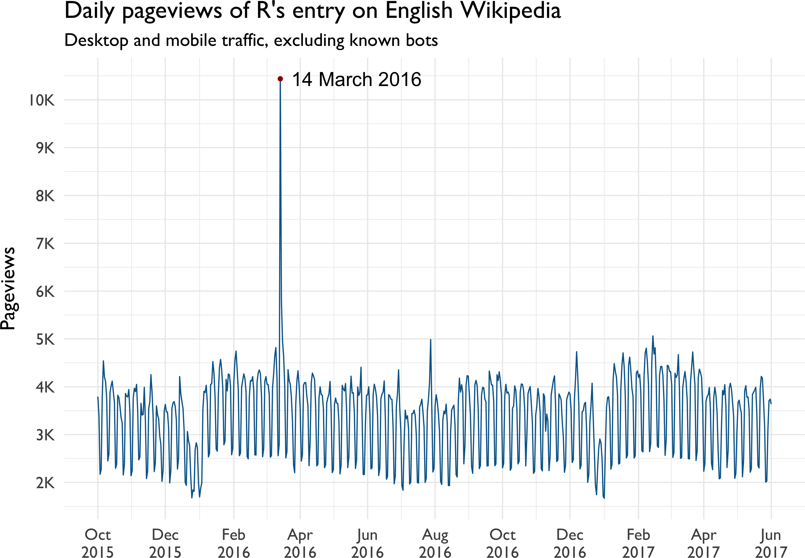

# Open knowledge in R with Wikimedia APIs

By Mikhail Popov, [Wikimedia Foundation](https://wikimediafoundation.org)

## Table of Contents

-   [Introduction](#introduction)
-   [Session Info](#session-info)
-   [Pageviews](#pageviews)
-   [Wikidata](#wikidata)
-   [Wikidata Query Service (WDQS)](#wikidata-query-service-wdqs)
-   [Basic SPARQL Example](#basic-sparql-example)
-   [Advanced SPARQL Example](#advanced-sparql-example)
-   [Final Remarks](#final-remarks)

Introduction
------------

[Wikimedia Foundation](https://wikimediafoundation.org/) is a non-profit that operates free & open projects like [Wikipedia](https://www.wikipedia.org/), [Wiktionary](https://www.wiktionary.org/), and [Wikidata](https://www.wikidata.org/) that anyone can contribute to

No time to talk about me (plus that's always the boring part)[^1]

A Markdown copy of this deck is at [git.io/vSi6a](https://git.io/vSi6a) for following along

R packages required to follow along:

``` r
install.packages(
  c("pageviews", "WikipediR", "WikidataR",
    "WikidataQueryServiceR", "magrittr"),
  repos = c(CRAN = "https://cran.rstudio.com")
)
```

Session Info
------------

-   Running R 3.4.0 on macOS Sierra 10.12.4
-   Rendered with [rmarkdown](http://rmarkdown.rstudio.com/) 1.4 and [knitr](https://yihui.name/knitr/) 1.15.1
-   The pipe (`%>%`) from [magrittr](https://cran.r-project.org/package=magrittr) is **occasionally** used
-   Using the following versions of packages for demos:

| Package               | Version | Imports                          |
|:----------------------|:--------|:---------------------------------|
| pageviews             | 0.3.0   | jsonlite, httr, curl             |
| WikipediR             | 1.5.0   | httr, jsonlite                   |
| WikidataR             | 1.2.0   | httr, jsonlite, WikipediR, utils |
| WikidataQueryServiceR | 0.1.0   | httr, dplyr, jsonlite            |

Pageviews
---------

WMF provides an [API for accessing daily and monthly pageviews of any article on any project](https://wikitech.wikimedia.org/wiki/Analytics/PageviewAPI) for counts from 2015 onwards.[^2] The package [pageviews](https://cran.r-project.org/package=pageviews) allows you to get those counts in R:

``` r
library(pageviews)
r_pageviews <- article_pageviews(
  project = "en.wikipedia",
  article = "R (programming language)",
  user_type = "user", start = "2015100100",
  end = format(Sys.time(), "%Y%m%d%H%M00")
)
```

------------------------------------------------------------------------

``` r
library(ggplot2)
r_pageviews$date %<>% as.Date()
ggplot(r_pageviews, aes(x = date, y = views)) +
  geom_line(color = rgb(0, 102, 153, maxColorValue = 255)) +
  geom_text(data = dplyr::top_n(r_pageviews, 1, views),
            aes(x = date, y = views, label = format(date, "%d %B %Y"),
                hjust = "left"), nudge_x = 10, size = 6) +
  geom_point(data = dplyr::top_n(r_pageviews, 1, views),
             aes(x = date, y = views), color = rgb(153/255, 0, 0)) +
  scale_y_continuous(
    breaks = seq(2e3, 10e3, 1e3),
    labels = function(x) { return(sprintf("%.0fK", x/1e3)) }
  ) +
  scale_x_date(date_breaks = "2 months", date_labels = "%b\n%Y") +
  labs(x = NULL, y = "Pageviews",
       title = "Daily pageviews of R's entry on English Wikipedia",
       subtitle = "Desktop and mobile traffic, excluding known bots") +
  theme_minimal(base_size = 18, base_family = "Gill Sans")
```



Wikidata
--------

-   [Wikidata](https://www.wikidata.org/) is a language-agnostic open knowledge base
-   Facts are expressed as 3-part statements:
    -   Subject (resource)
    -   Predicate (property type)
    -   Object (property value, can be another resource)
-   Examples:
    -   "R" ([Q206904](https://www.wikidata.org/wiki/Q206904)) is an "instance of" ([P31](https://www.wikidata.org/wiki/Property:P31)) a "programming language" ([Q9143](https://www.wikidata.org/wiki/Q9143))
    -   "RStudio" ([Q4798119](https://www.wikidata.org/wiki/Q4798119)) was "programmed in" ([P277](https://www.wikidata.org/wiki/Property:P277)) "C++" ([Q2407](https://www.wikidata.org/wiki/Q2407))
    -   "Portland" ([Q6106](https://www.wikidata.org/wiki/Q6106)) had a "population" ([P1082](https://www.wikidata.org/wiki/Property:P1082)) of 583,776 (in 2010)
-   Resources and properties have unique numeric identifiers but can have human-friendly labels in any language

Wikidata Query Service (WDQS)
-----------------------------

-   Allows querying Wikidata with [SPARQL](https://en.wikipedia.org/wiki/SPARQL)
-   Provides a public SPARQL endpoint usable via:
    -   Web front-end: [query.wikidata.org](https://query.wikidata.org/)
    -   Web API (`https://query.wikidata.org/sparql?query=<SPARQL>`)
    -   In Python with [SPARQLWrapper](https://rdflib.github.io/sparqlwrapper/)
    -   In R with:
        -   [SPARQL](https://cran.r-project.org/package=SPARQL) package
        -   [WikidataQueryServiceR](https://cran.r-project.org/package=WikidataQueryServiceR)
-   For useful reference links, see `help("WDQS", package = "WikidataQueryServiceR")`

Basic SPARQL Example
--------------------

    # PREFIXes are optional when using WDQS
    PREFIX wd: <http://www.wikidata.org/entity/>
    PREFIX wdt: <http://www.wikidata.org/prop/direct/>
    PREFIX wikibase: <http://wikiba.se/ontology#>
    PREFIX bd: <http://www.bigdata.com/rdf#>

    SELECT DISTINCT ?instanceOfLabel
    WHERE {
      wd:Q206904 wdt:P31 ?instanceOf .
      SERVICE wikibase:label {
        bd:serviceParam wikibase:language "en"
      }
    }

------------------------------------------------------------------------

``` r
library(WikidataQueryServiceR)
query_wikidata('SELECT DISTINCT ?instanceOfLabel
WHERE {
  wd:Q206904 wdt:P31 ?instanceOf .
  SERVICE wikibase:label {
    bd:serviceParam wikibase:language "en"
  }
}') %>% head(n = 5L)
```

    ##                       instanceOfLabel
    ## 1                programming language
    ## 2                       free software
    ## 3 multi-paradigm programming language
    ## 4                interpreted language
    ## 5     functional programming language

Advanced SPARQL Example
-----------------------

-   Prefix `wd:` points to an entity
-   Prefix `p:` points not to the object, but to a statement node
-   Prefix `ps:` within the statement node retrieves the object (value)
-   Prefix `pq:` within the statement node retrieves the qualifier info

``` r
r_versions_query <- "SELECT DISTINCT
  ?softwareVersion ?publicationDate
WHERE {
  BIND(wd:Q206904 AS ?R)
  ?R p:P348 [
    ps:P348 ?softwareVersion;
    pq:P577 ?publicationDate
  ] .
}"
```

------------------------------------------------------------------------

``` r
r_versions_results <- query_wikidata(r_versions_query)
```

### Results

| softwareVersion | publicationDate      |
|:----------------|:---------------------|
| 1.0.0           | 2000-02-29T00:00:00Z |
| 2.0.0           | 2004-10-04T00:00:00Z |
| 2.15.3          | 2013-03-01T00:00:00Z |
| ...             | ...                  |
| 3.3.2           | 2016-10-31T00:00:00Z |
| 3.3.3           | 2017-03-06T00:00:00Z |
| 3.4.0           | 2017-04-21T00:00:00Z |

Final Remarks
-------------

Source for the whole shebang is up on GitHub: [bearloga/wmf](https://github.com/bearloga/wmf/tree/master/presentations/talks/Cascadia%20R%20Conference%202017), available under [CC BY-SA 4.0](https://creativecommons.org/licenses/by-sa/4.0/)

Specifically: wmf/presentations/talks/Cascadia R Conference 2017/

### Contact Info

-   **Twitter**: [bearloga](https://twitter.com/bearloga)
-   **WMF-related**: <mikhail@wikimedia.org> (PGP public key: [people.wikimedia.org/~bearloga/public.asc](https://people.wikimedia.org/~bearloga/public.asc))
-   **General**: <mikhail@mpopov.com> (PGP public key on [keybase.io/mikhailpopov](https://keybase.io/mikhailpopov))

[^1]: If you're **really** curious just search for [User:MPopov (WMF)](https://meta.wikimedia.org/wiki/User:MPopov_(WMF)) on [Meta-Wiki](https://meta.wikimedia.org/)

[^2]: [wikipediatrend](https://cran.r-project.org/package=wikipediatrend) package wraps the [stats.grok.se](http://stats.grok.se/) API which has historical Wikipedia pageview data for 2008 up to 2016 from [these pageview count dumps](https://dumps.wikimedia.org/other/pagecounts-raw/).
