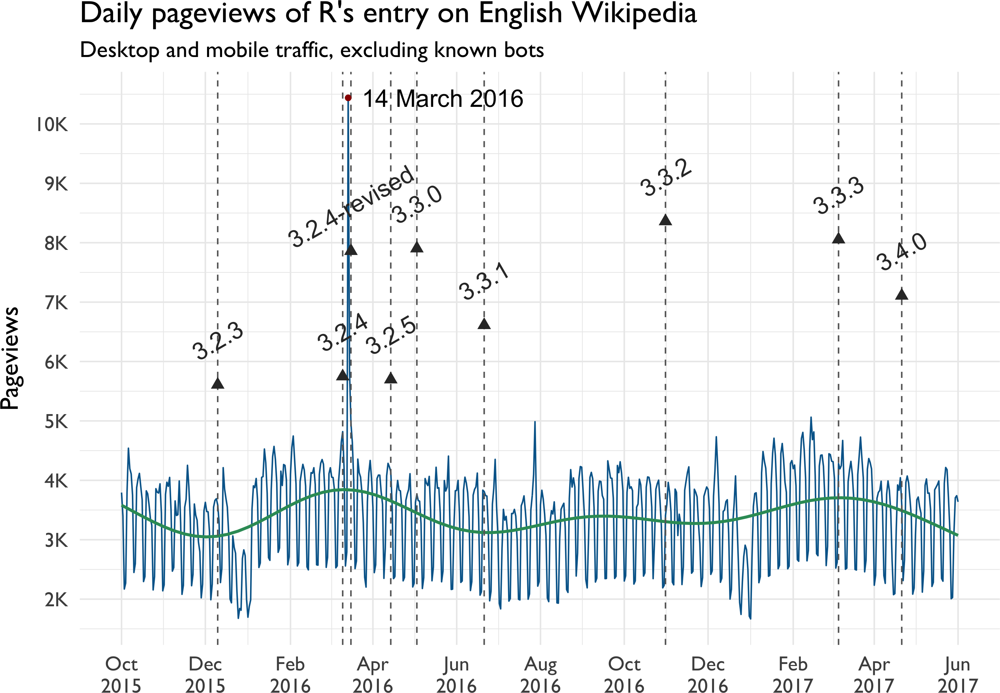

# Open knowledge in R with Wikimedia APIs

By Mikhail Popov, [Wikimedia Foundation](https://wikimediafoundation.org)

## Table of Contents

-   [Introduction](#introduction)
-   [Session Info](#session-info)
-   [Wikipedia](#wikipedia)
-   [WikipediR](#wikipedir)
-   [MediaWiki-powered sites' APIs](#mediawiki-powered-sites-apis)
-   [Pageviews](#pageviews)
-   [Wikidata](#wikidata)
-   [WikidataR](#wikidatar)
-   [Wikidata Query Service (WDQS)](#wikidata-query-service-wdqs)
-   [Basic SPARQL Example](#basic-sparql-example)
-   [Advanced SPARQL Example](#advanced-sparql-example)
-   [Final Remarks](#final-remarks)

Introduction
------------

[Wikimedia Foundation](https://wikimediafoundation.org/) is a non-profit that operates free & open projects like [Wikipedia](https://www.wikipedia.org/), [Wiktionary](https://www.wiktionary.org/), and [Wikidata](https://www.wikidata.org/) that anyone can contribute to

No time to talk about me (plus that's always the boring part)[^1]

A Markdown copy of this deck is at [git.io/vSi6a](https://git.io/vSi6a) for following along

R packages required to follow along:

``` r
install.packages(
  c("pageviews", "WikipediR", "WikidataR",
    "WikidataQueryServiceR", "magrittr"),
  repos = c(CRAN = "https://cran.rstudio.com")
)
```

Session Info
------------

``` r
suppressPackageStartupMessages({
  library(magrittr)
  library(ggplot2)
  library(dplyr)
  library(lubridate)
  library(knitr)
  library(xml2)
})
```

-   Running R 3.4.0 on macOS Sierra 10.12.4
-   Rendered with [rmarkdown](http://rmarkdown.rstudio.com/) 1.4 and [knitr](https://yihui.name/knitr/) 1.15.1
-   The pipe (`%>%`) from [magrittr](https://cran.r-project.org/package=magrittr) is **occasionally** used
-   Using the following versions of packages for demos:

| Package               | Version | Imports                          |
|:----------------------|:--------|:---------------------------------|
| pageviews             | 0.3.0   | jsonlite, httr, curl             |
| WikipediR             | 1.5.0   | httr, jsonlite                   |
| WikidataR             | 1.2.0   | httr, jsonlite, WikipediR, utils |
| WikidataQueryServiceR | 0.1.0   | httr, dplyr, jsonlite            |

Wikipedia
---------


-   [Wikipedia](https://www.wikipedia.org/) is a free encyclopedia that anyone can edit
-   You may have heard of it
-   It is available in 296 languages
-   English Wikipedia has over 5.3 million articles
-   Wikipedia is powered by [MediaWiki](https://www.mediawiki.org/wiki/MediaWiki), which includes an [API](https://www.mediawiki.org/wiki/API:Main_page) that makes it fast and easy to fetch content

WikipediR
---------

[WikipediR](https://cran.r-project.org/package=WikipediR) is a wrapper for MediaWiki API but aimed at Wikimedia's wikis such as Wikipedia. It can be used to retrieve page text, information about users or the history of pages, and elements of the category tree.

``` r
library(WikipediR)
r_wiki <- page_content(
  language = "en",
  project = "wikipedia",
  page_name = "R (programming language)"
)
r_releases <- r_wiki$parse$text$`*` %>%
  read_html %>%
  xml_find_first(".//table[@class='wikitable']") %>%
  rvest::html_table()
```

------------------------------------------------------------------------

| Release | Date       | Description                                 |
|:--------|:-----------|:--------------------------------------------|
| 0.16    |            | This is the last alpha version developed... |
| 0.49    | 1997-04-23 | This is the oldest source release which ... |
| 0.60    | 1997-12-05 | R becomes an official part of the GNU Pr... |
| 0.65.1  | 1999-10-07 | First versions of update.packages and in... |
| 1.0     | 2000-02-29 | Considered by its developers stable enou... |
| 1.4     | 2001-12-19 | S4 methods are introduced and the first ... |
| 2.0     | 2004-10-04 | Introduced lazy loading, which enables f... |
| 2.1     | 2005-04-18 | Support for UTF-8 encoding, and the begi... |
| 2.11    | 2010-04-22 | Support for Windows 64 bit systems....      |
| 2.13    | 2011-04-14 | Adding a new compiler function that allo... |
| 2.14    | 2011-10-31 | Added mandatory namespaces for packages.... |
| 2.15    | 2012-03-30 | New load balancing functions. Improved s... |
| 3.0     | 2013-04-03 | Support for numeric index values 231 and... |

MediaWiki-powered sites' APIs
-----------------------------

-   Use `language` and `project` arguments for Wikimedia's wikis[^2]
-   Use `domain` for everything else, such as:
    -   Project Gutenberg's wiki: `domain = "www.gutenberg.org/w/api.php"`
    -   Mozilla Foundation's wiki: `domain = "wiki.mozilla.org/api.php"`
    -   Geek Feminism wiki: `domain = "geekfeminism.wikia.com/api.php"`
    -   A Wiki of Ice and Fire: `domain = "awoiaf.westeros.org/api.php"`
-   **Tip**: if using `random_page`, specify `namespaces = 0` to only get articles

Pageviews
---------

WMF provides an [API for accessing daily and monthly pageviews of any article on any project](https://wikitech.wikimedia.org/wiki/Analytics/PageviewAPI) for counts from 2015 onwards.[^3] The package [pageviews](https://cran.r-project.org/package=pageviews) allows you to get those counts in R:

``` r
library(pageviews)
r_pageviews <- article_pageviews(
  project = "en.wikipedia",
  article = "R (programming language)",
  user_type = "user", start = "2015100100",
  end = format(Sys.Date() - 1, "%Y%m%d00")
)
```

------------------------------------------------------------------------

``` r
r_pageviews$date %<>% as.Date()
ggplot(r_pageviews, aes(x = date, y = views)) +
  geom_line(color = rgb(0, 102, 153, maxColorValue = 255)) +
  geom_text(data = dplyr::top_n(r_pageviews, 1, views),
            aes(x = date, y = views, label = format(date, "%d %B %Y"),
                hjust = "left"), nudge_x = 10, size = 6) +
  geom_point(data = dplyr::top_n(r_pageviews, 1, views),
             aes(x = date, y = views), color = rgb(153/255, 0, 0)) +
  scale_y_continuous(
    breaks = seq(2e3, 10e3, 1e3),
    labels = function(x) { return(sprintf("%.0fK", x/1e3)) }
  ) +
  scale_x_date(date_breaks = "2 months", date_labels = "%b\n%Y") +
  labs(x = NULL, y = "Pageviews",
       title = "Daily pageviews of R's entry on English Wikipedia",
       subtitle = "Desktop and mobile traffic, excluding known bots") +
  theme_minimal(base_size = 18, base_family = "Gill Sans")
```


Wikidata
--------

-   [Wikidata](https://www.wikidata.org/) is a language-agnostic open knowledge base
-   Facts are expressed as 3-part statements:
    -   Subject (resource)
    -   Predicate (property type)
    -   Object (property value, can be another resource)
-   Examples:
    -   "R" ([Q206904](https://www.wikidata.org/wiki/Q206904)) is an "instance of" ([P31](https://www.wikidata.org/wiki/Property:P31)) a "programming language" ([Q9143](https://www.wikidata.org/wiki/Q9143))
    -   "RStudio" ([Q4798119](https://www.wikidata.org/wiki/Q4798119)) was "programmed in" ([P277](https://www.wikidata.org/wiki/Property:P277)) "C++" ([Q2407](https://www.wikidata.org/wiki/Q2407))
    -   "Portland" ([Q6106](https://www.wikidata.org/wiki/Q6106)) had a "population" ([P1082](https://www.wikidata.org/wiki/Property:P1082)) of 583,776 (in 2010)
-   Resources and properties have unique numeric identifiers but can have human-friendly labels in any language

WikidataR
---------

``` r
library(WikidataR)
r_search <- find_item("R")[[8]]
r_search[c("id", "description")] # check the results
```

    ## $id
    ## [1] "Q206904"
    ## 
    ## $description
    ## [1] "programming language for statistical computing"

------------------------------------------------------------------------

``` r
property <- get_property("P31")
property$labels$`en`$value # check that we want P31
```

    ## [1] "instance of"

``` r
r_item <- get_item(r_search$id)
r_item$claims$P31$mainsnak$datavalue$value$id # extract values
```

    ## [1] "Q9143"     "Q341"      "Q20825628" "Q28920142" "Q3839507"  "Q12772052"
    ## [7] "Q1993334"  "Q24529812"

This tells us that R is an instance of Q9143, Q341, Q20825628, Q28920142, Q3839507, Q12772052, Q1993334, Q24529812. Great?

Wikidata Query Service (WDQS)
-----------------------------

-   Allows querying Wikidata with [SPARQL](https://en.wikipedia.org/wiki/SPARQL)
-   Provides a public SPARQL endpoint usable via:
    -   Web front-end: [query.wikidata.org](https://query.wikidata.org/)
    -   Web API (`https://query.wikidata.org/sparql?query=<SPARQL>`)
    -   In Python with [SPARQLWrapper](https://rdflib.github.io/sparqlwrapper/)
    -   In R with:
        -   [SPARQL](https://cran.r-project.org/package=SPARQL) package
        -   [WikidataQueryServiceR](https://cran.r-project.org/package=WikidataQueryServiceR)
-   For useful reference links, see `help("WDQS", package = "WikidataQueryServiceR")`

Basic SPARQL Example
--------------------

    # PREFIXes are optional when using WDQS
    PREFIX wd: <http://www.wikidata.org/entity/>
    PREFIX wdt: <http://www.wikidata.org/prop/direct/>
    PREFIX wikibase: <http://wikiba.se/ontology#>
    PREFIX bd: <http://www.bigdata.com/rdf#>

    SELECT DISTINCT ?instanceOfLabel
    WHERE {
      wd:Q206904 wdt:P31 ?instanceOf .
      SERVICE wikibase:label {
        bd:serviceParam wikibase:language "en"
      }
    }

------------------------------------------------------------------------

``` r
library(WikidataQueryServiceR)
query_wikidata('SELECT DISTINCT ?instanceOfLabel
WHERE {
  wd:Q206904 wdt:P31 ?instanceOf .
  SERVICE wikibase:label {
    bd:serviceParam wikibase:language "en"
  }
}') %>% head(n = 5L)
```

    ##                       instanceOfLabel
    ## 1                programming language
    ## 2                       free software
    ## 3 multi-paradigm programming language
    ## 4                interpreted language
    ## 5     functional programming language

Advanced SPARQL Example
-----------------------

-   Prefix `wd:` points to an entity
-   Prefix `p:` points not to the object, but to a statement node
-   Prefix `ps:` within the statement node retrieves the object (value)
-   Prefix `pq:` within the statement node retrieves the qualifier info

``` r
r_versions_query <- "SELECT DISTINCT
  ?softwareVersion ?publicationDate
WHERE {
  BIND(wd:Q206904 AS ?R)
  ?R p:P348 [
    ps:P348 ?softwareVersion;
    pq:P577 ?publicationDate
  ] .
}"
```

------------------------------------------------------------------------

``` r
r_versions_results <- query_wikidata(r_versions_query)
```

``` r
r_versions_results %<>%
  arrange(publicationDate) %>%
  mutate(publicationDate = as.Date(ymd_hms(publicationDate)))
```

| softwareVersion | publicationDate |
|:----------------|:----------------|
| 1.0.0           | 2000-02-29      |
| 2.0.0           | 2004-10-04      |
| 2.15.3          | 2013-03-01      |
| ...             | ...             |
| 3.3.2           | 2016-10-31      |
| 3.3.3           | 2017-03-06      |
| 3.4.0           | 2017-04-21      |

------------------------------------------------------------------------

``` r
set.seed(20170603)
r_versions_results %<>% mutate(position = 8e3 + runif(nrow(.), -2e3, 2e3))
ggplot(r_pageviews, aes(x = date, y = views)) +
  geom_vline(data = filter(r_versions_results, publicationDate >= "2015-10-01"),
             aes(xintercept = as.numeric(publicationDate)),
             color = "gray40", linetype = "dashed") +
  geom_line(color = rgb(0, 102, 153, maxColorValue = 255)) +
  geom_text(data = dplyr::top_n(r_pageviews, 1, views),
            aes(x = date, y = views, label = format(date, "%d %B %Y"),
                hjust = "left"), nudge_x = 10, size = 6) +
  geom_text(data = filter(r_versions_results, publicationDate >= "2015-10-01"),
            aes(x = publicationDate, label = softwareVersion, y = position),
            color = "gray20", size = 6, angle = 30) +
  geom_point(data = filter(r_versions_results, publicationDate >= "2015-10-01"),
            aes(x = publicationDate, y = position - 7.5e2),
            color = "gray20", size = 3, shape = 17) +
  geom_point(data = dplyr::top_n(r_pageviews, 1, views),
             aes(x = date, y = views), color = rgb(153/255, 0, 0)) +
  scale_y_continuous(
    breaks = seq(2e3, 10e3, 1e3),
    labels = function(x) { return(sprintf("%.0fK", x/1e3)) }
  ) +
  scale_x_date(date_breaks = "2 months", date_labels = "%b\n%Y") +
  labs(x = NULL, y = "Pageviews",
       title = "R's releases and article pageviews on English Wikipedia",
       subtitle = "Desktop and mobile traffic, excluding known bots") +
  theme_minimal(base_size = 18, base_family = "Gill Sans")
```



Final Remarks
-------------

Source for the whole shebang is up on GitHub: [bearloga/wmf](https://github.com/bearloga/wmf/tree/master/presentations/talks/Cascadia%20R%20Conference%202017), available under [CC BY-SA 4.0](https://creativecommons.org/licenses/by-sa/4.0/)

Specifically: wmf/presentations/talks/Cascadia R Conference 2017/

### Contact Info

-   **Twitter**: [bearloga](https://twitter.com/bearloga)
-   **WMF-related**: <mikhail@wikimedia.org> (PGP public key: [people.wikimedia.org/~bearloga/public.asc](https://people.wikimedia.org/~bearloga/public.asc))
-   **General**: <mikhail@mpopov.com> (PGP public key on [keybase.io/mikhailpopov](https://keybase.io/mikhailpopov))

[^1]: If you're **really** curious just search for [User:MPopov (WMF)](https://meta.wikimedia.org/wiki/User:MPopov_(WMF)) on [Meta-Wiki](https://meta.wikimedia.org/)

[^2]: Currently: [Commons](https://commons.wikimedia.org/), [Wikivoyage](https://www.wikivoyage.org/), [Wikiquote](https://www.wikiquote.org/), [Wikisource](https://www.wikisource.org/), [Wikibooks](https://www.wikibooks.org/), [Wikinews](https://www.wikinews.org/), [Wikiversity](https://www.wikiversity.org/), [Wikispecies](https://species.wikimedia.org/), [MediaWiki](https://www.mediawiki.org/), [Meta-Wiki](https://meta.wikimedia.org/), [Wiktionary](https://www.wiktionary.org/)

[^3]: [wikipediatrend](https://cran.r-project.org/package=wikipediatrend) package wraps the [stats.grok.se](http://stats.grok.se/) API which has historical Wikipedia pageview data for 2008 up to 2016 from [these pageview count dumps](https://dumps.wikimedia.org/other/pagecounts-raw/)
