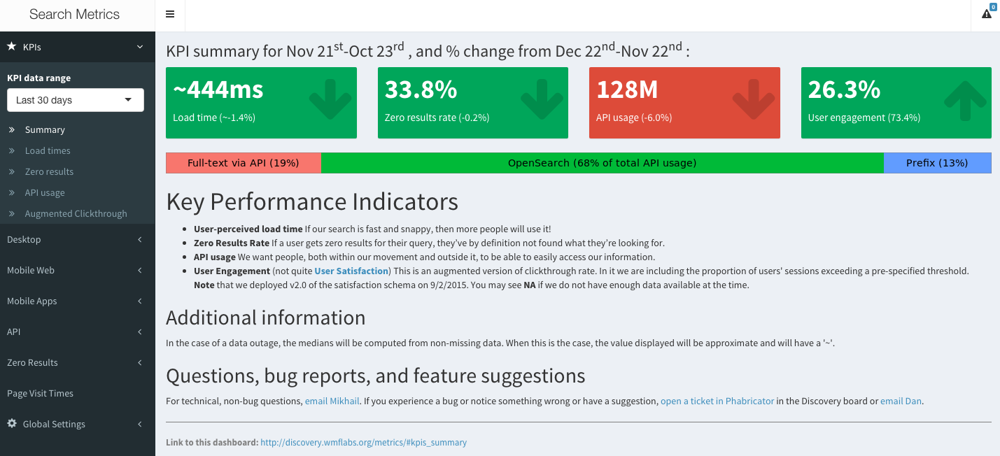
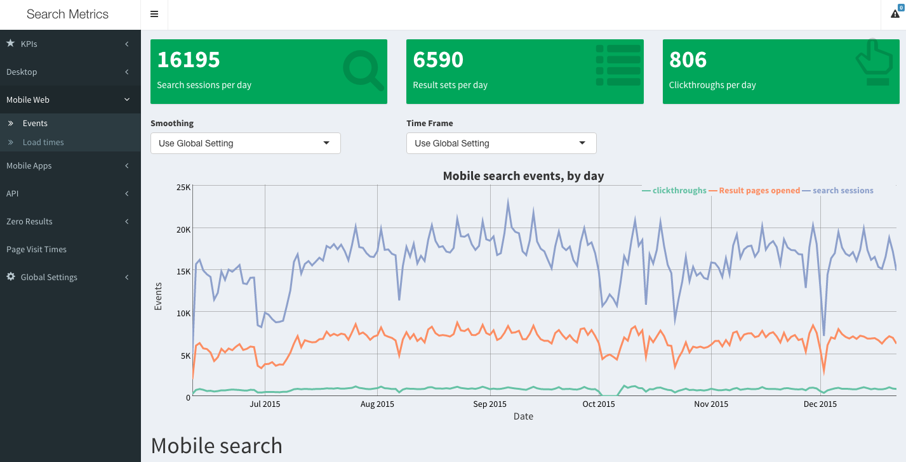
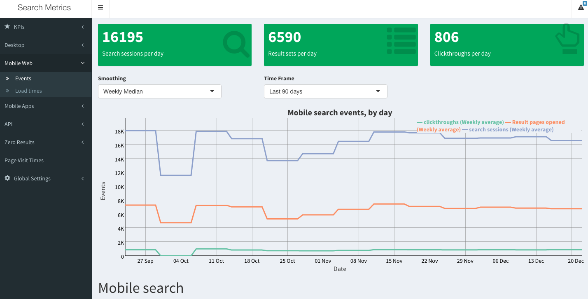
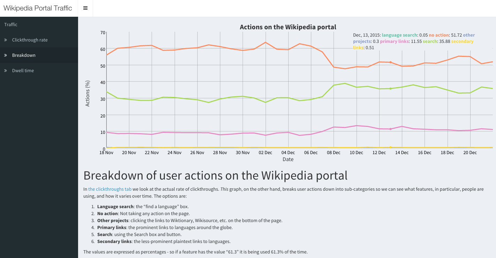
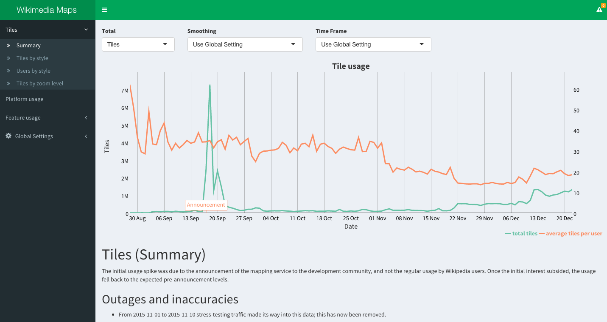
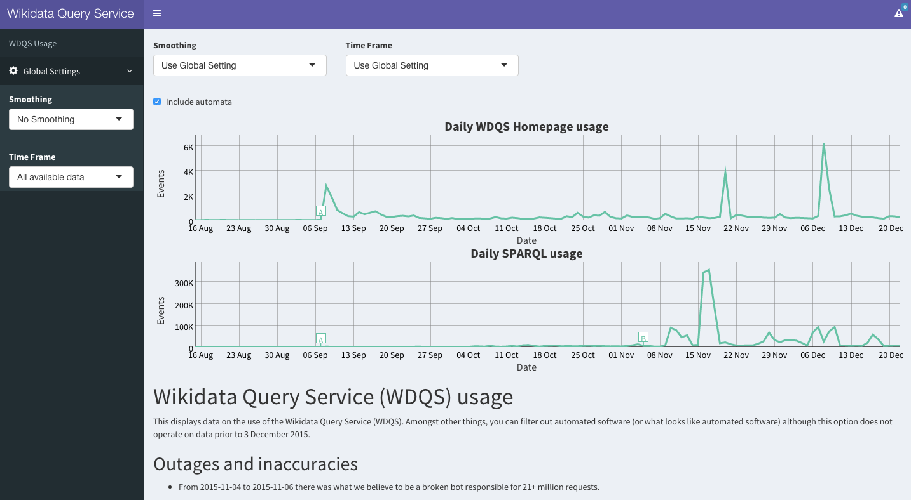
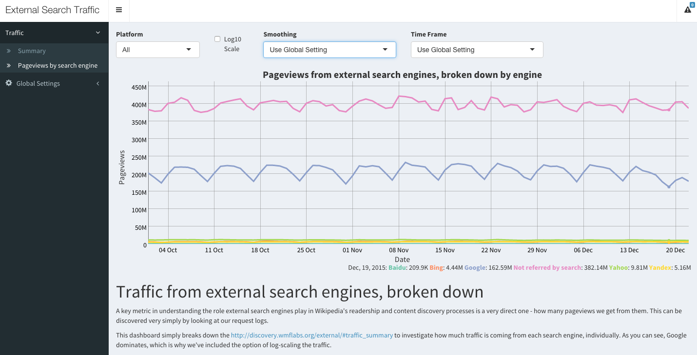

Dashboarding and Testing in Discovery
========================================================
author: Oliver Keyes and Mikhail Popov
date: 6 January 2016
font-family: 'Helvetica'
css: custom.css

Dashboards
========================================================
These contain everything from API usage to direct user interactions, and provide data for internal and external use to see how well we're doing.

- Search Metrics (http://discovery.wmflabs.org/metrics/)
- Portal Metrics (http://discovery.wmflabs.org/portal/)
- WDQS Metrics (http://discovery.wmflabs.org/wdqs/)
- Maps Metrics (http://discovery.wmflabs.org/maps/)
- External Referrals (http://discovery.wmflabs.org/external/)

Dashboard: Search Metrics (KPIs)
========================================================


Dashboard: Search Metrics (Time Series)
========================================================


Dashboard: Search Metrics (Smoothing)
========================================================


Dashboard: Wikipedia Portal Metrics
========================================================


Dashboard: Maps Metrics
========================================================


Dashboard: Wikidata Query Service (WDQS) Metrics
========================================================


Dashboard: External Referral (Search Engines)
========================================================



Slide With Code
========================================================
class: small-code

```r
summary(cars)
```

```
     speed           dist       
 Min.   : 4.0   Min.   :  2.00  
 1st Qu.:12.0   1st Qu.: 26.00  
 Median :15.0   Median : 36.00  
 Mean   :15.4   Mean   : 42.98  
 3rd Qu.:19.0   3rd Qu.: 56.00  
 Max.   :25.0   Max.   :120.00  
```
